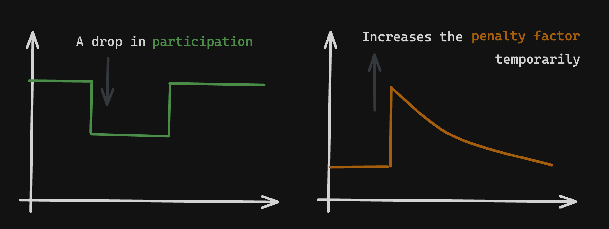

# Anti correlation penalties FAQ

The decentralization of the validator set is one of the most important properties of Ethereum for credible neutrality and censorship resistance. By adjusting penalties to foster decentralization, diversification and fault-tolerance, diversified entities get lower penalties while entities with high correlations in their setup face more severe ones.

## Learn more

- [Lighthouse implementation](https://github.com/igorline/lighthouse/pull/1)
- [EIP draft](https://github.com/ethereum/EIPs/commit/42a8d6424d048724ec4d5a41ec9418cf50ec95d2)
- [Quantitative analysis](https://ethresear.ch/t/analysis-on-correlated-attestation-penalties/19244)
- [Original proposal](https://ethresear.ch/t/a-concrete-proposal-for-correlated-attester-penalties/19341)

## Why?

Ethereum already features anti-correlation penalties today. But they only happen during rare network conditions, namely:
- During a mass slashing event: where billions of stake sign conflicting messages
- During a finality leak: where the chain stops finalizing for hours / days

Anti-correlation penalties are smaller and much more sensitive, such that they are perceived during normal operations.

## How?

Offline penalties are now scaled by a new factor called **penalty factor**. When a lot of stake goes offline at the same time, the penalty factor increases temporarily.

Operators managing enough stake may respond to the proposal with any of this actions:
- Diversify their setup to reduce the probability of correlated offline behaviour
- Improve the performance of their existing setup to not be offline

Both strategies should increase costs and reduce the economies of scale that large operators enjoy.

